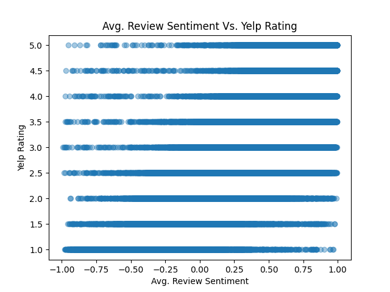
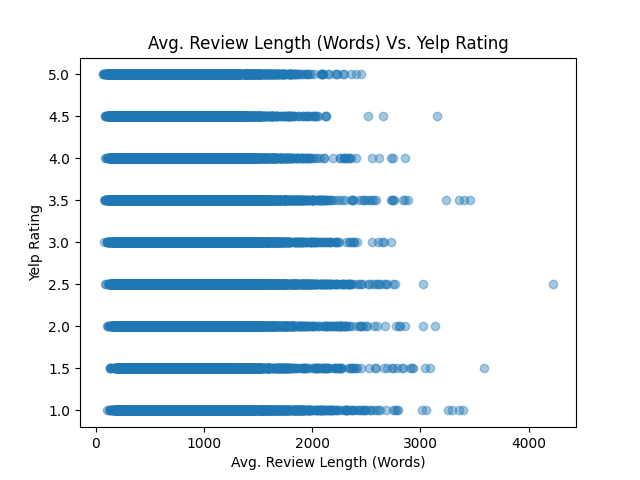
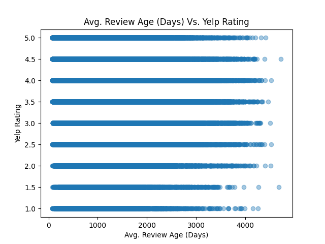
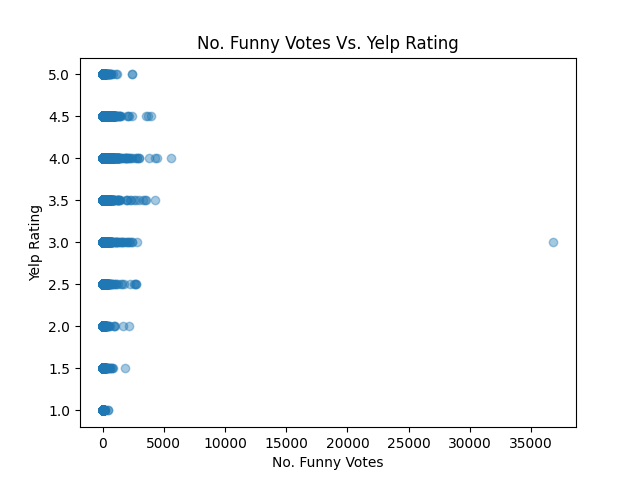
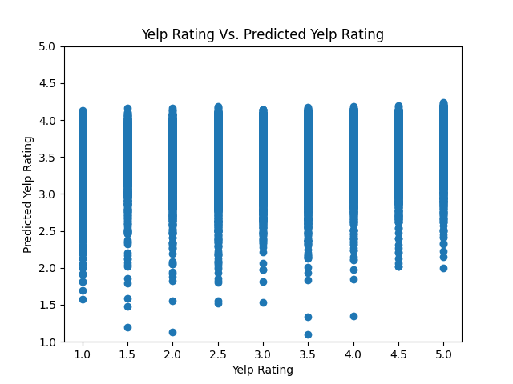
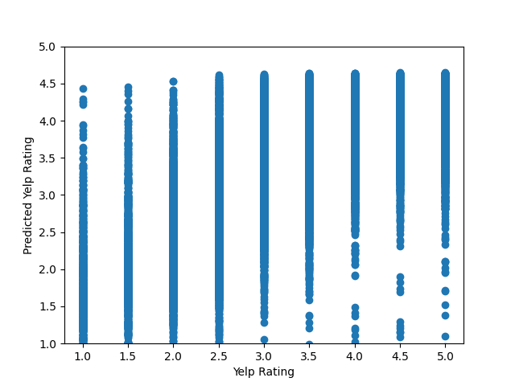
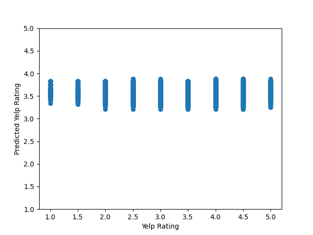
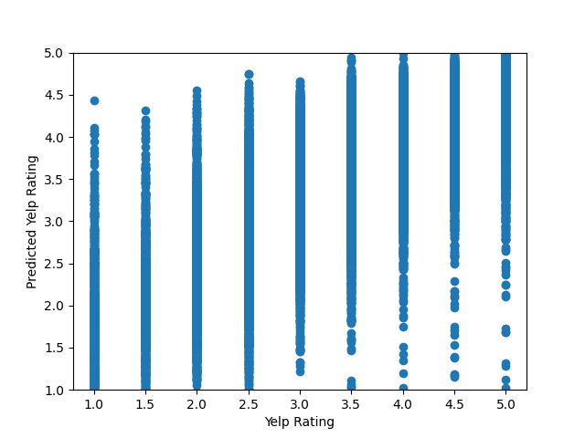
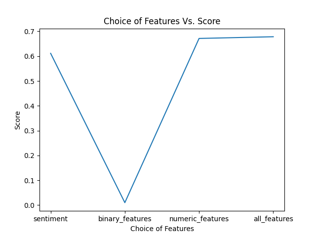

# Yelp-Restaurant-s-Rate-Predictor
A Linear Regression model built on the famous rating service (Yelp!) for predicting restaurant's rating.

# Correlations

# Modeling Based on Sentiment-only 

# Modeling Based on Binary Features

# Modeling Based on Numeric Features

# Modeling Based on All Features

# Visualizing Scores

